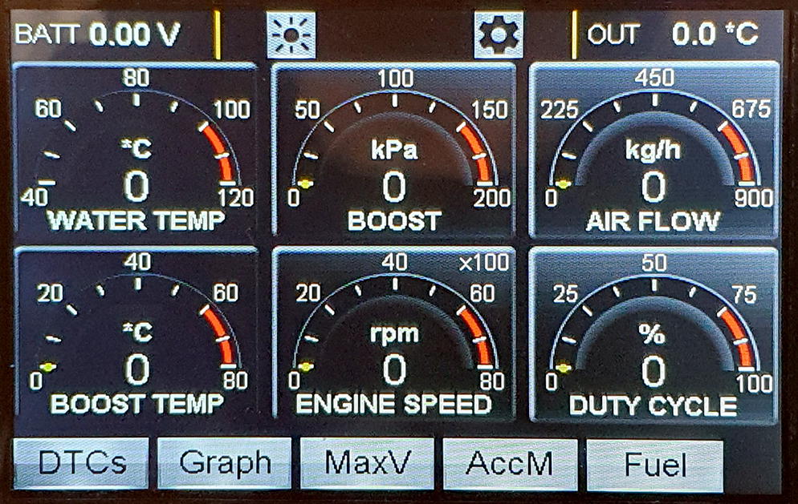
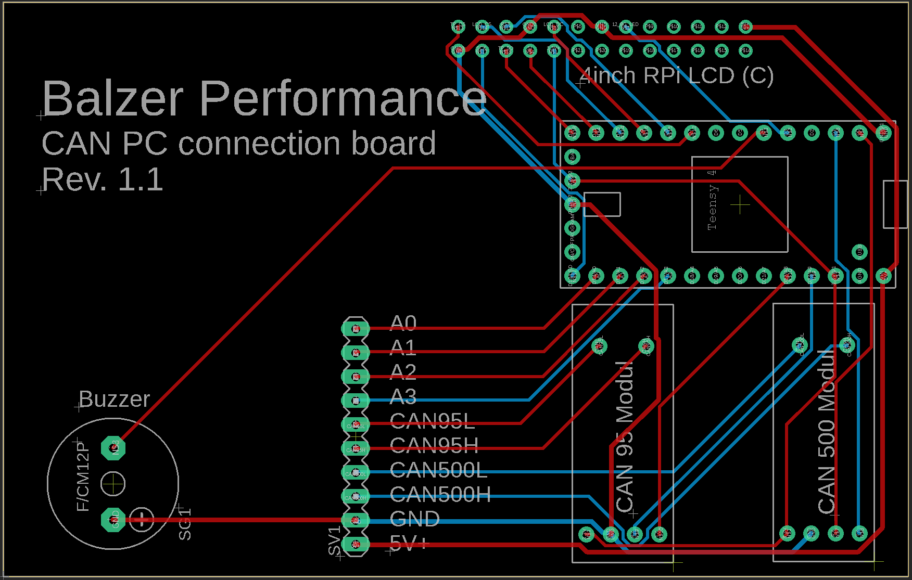

# Opel_Astra_H_opc_CAN-GaugeV2
New version, looks like BC from Nissan GT-R and uses large touchscreen
Needs Waveshare 4inch RPi LCD (C) ILI9486 display and lib

 
Watch demo on https://youtu.be/G2oHpHkk6c8
 
 
<h2>Hardware:</h2> 
 - Teensy 4.0 
 - 2x Waveshare CAN Board SN65HVD230 
 - Waveshare 4inch RPi LCD (C) ILI9486 with XPT2046 Touch 
 - LM2596 DC/DC Converter - set 5.0 Volt output 
 
<h2>Car:</h2> Opel Astra H opc 2007 
 
<h2>Interface 1 connection:</h2> HSCAN 500 kBaud (Pin 6 and 14 on OBD connector) 
<h2>Interface 2 connection:</h2> MSCAN 33.3 kBaud (Pin 1 and 5(GND) on OBD connector) 
 
<h2>Circuit board layout (EAGLE)</h2> 
 
 
In order to be able to control the brightness of the LCD, you have to bridge these contacts on the back of the LCD. 
 
Then a wire must be laid from Teensy pin 3 to LCD pin 12 (included in Circuit-Board-Rev-1.1). 

