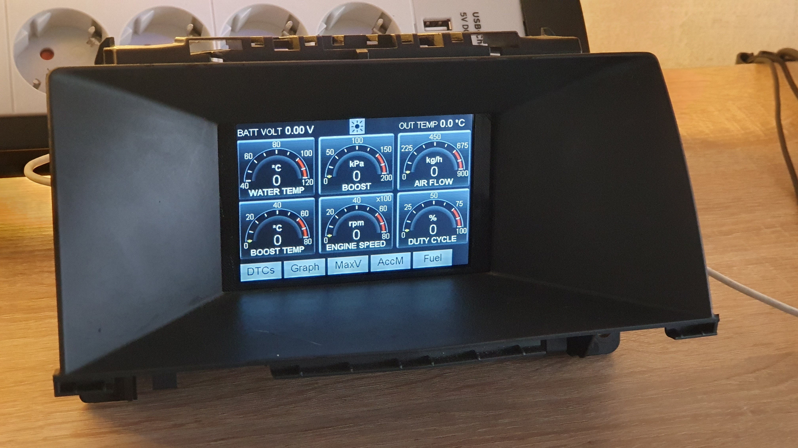

# Opel_Astra_H_opc_CAN-GaugeV2
New version, looks like BC from Nissan GT-R and uses large touchscreen
Needs Waveshare 4inch RPi LCD (C) ILI9486 display and lib

 
In order to be able to control the brightness of the LCD, you have to bridge these contacts on the back of the LCD. 
 
Then a wire must be laid from Teensy pin 3 to LCD pin 12. 

